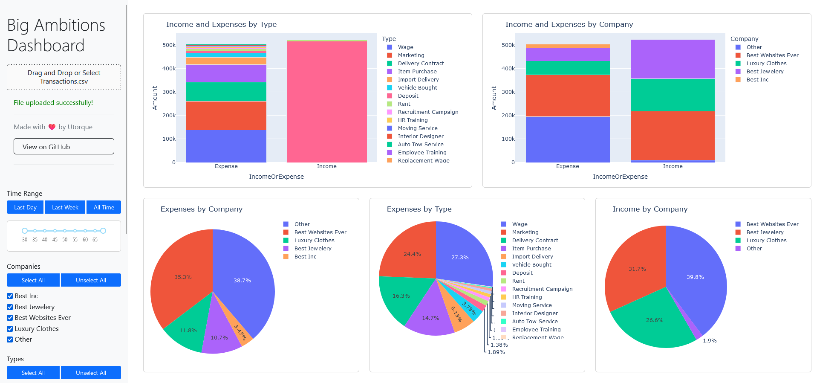
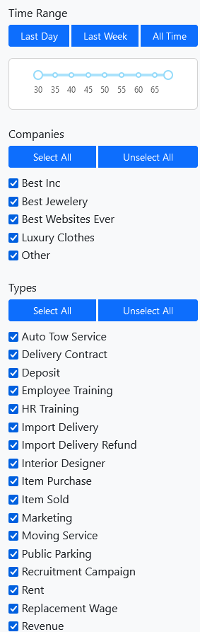
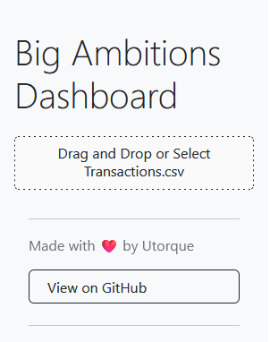

# Big Ambitions Dashboard 📊

A powerful visualization tool for analyzing your transactions in the game Big Ambitions. Get detailed insights into your business empire with beautiful, interactive charts!



## 🌐 Quick Start

The easiest way to use the dashboard is through the hosted version at:
**[bigambitions.utorque.ch](http://bigambitions.utorque.ch/)**

## 📈 Features

- **Instant Analysis**: Just drag and drop your Transactions.csv file and get immediate insights
- **Automatic Company Detection**: Companies are automatically identified from your transactions
- **Interactive Visualizations**: Click on graphs to drill down into specific data
- **Flexible Filtering**:
  - Time Range: Last Day, Last Week, or All Time with a slider for precise control
  - Companies: Filter specific businesses
  - Transaction Types: Focus on particular transaction categories
- **Comprehensive Views**:
  - Income and Expenses by Type
  - Income and Expenses by Company
  - Company-specific expense breakdown
  - Transaction type distribution
  - Income sources analysis


  
## 🎮 How to Use

1. In Big Ambitions, click on your money to open the "Detailed Transactions" view
2. Click "Export to CSV" - this will open your file explorer to the Transactions.csv location
3. Drag and drop this file into the dashboard
4. That's it! Your data will be automatically processed and visualized  


## 🛠️ Self-Hosting Options

### Docker (Recommended)
```bash
docker pull ghcr.io/utorque/bigambitions-dashboard:latest
docker run -p 80:80 ghcr.io/utorque/bigambitions-dashboard:latest
```

### Manual Setup
1. Clone the repository:
```bash
git clone https://github.com/Utorque/BigAmbitions-Dashboard.git
cd BigAmbitions-Dashboard
```

2. Install dependencies:
```bash
pip install -r requirements.txt
```

3. Run the application:
```bash
python app.py
```

4. Open your browser and navigate to `http://localhost:80`

## 📦 Dependencies

- **Python 3.11+**
- **Key Libraries**:
  - `dash`: Web application framework
  - `dash-bootstrap-components`: Bootstrap components for Dash
  - `pandas`: Data manipulation and analysis
  - `plotly`: Interactive plotting
  - Full list available in `requirements.txt`

## ❤️ Support

If you find this tool useful, consider supporting the development:

[](https://www.paypal.com/paypalme/ThibBart)

## 📝 License

This project is licensed under the MIT License - see the LICENSE file for details.

## 🙏 Acknowledgments
- [claude.ai](https://claude.ai) was used and abused during the making of this project